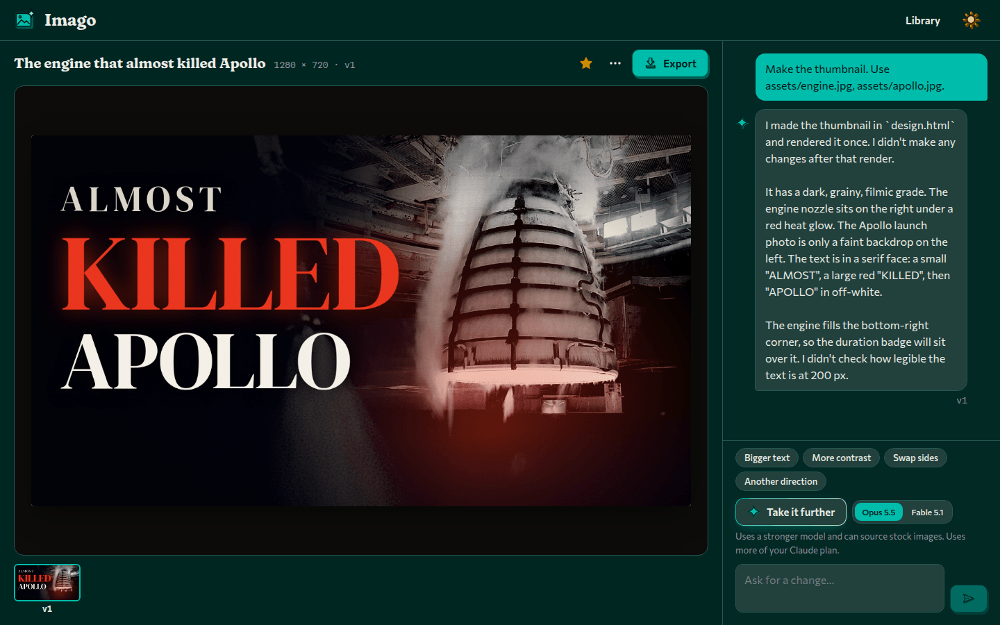
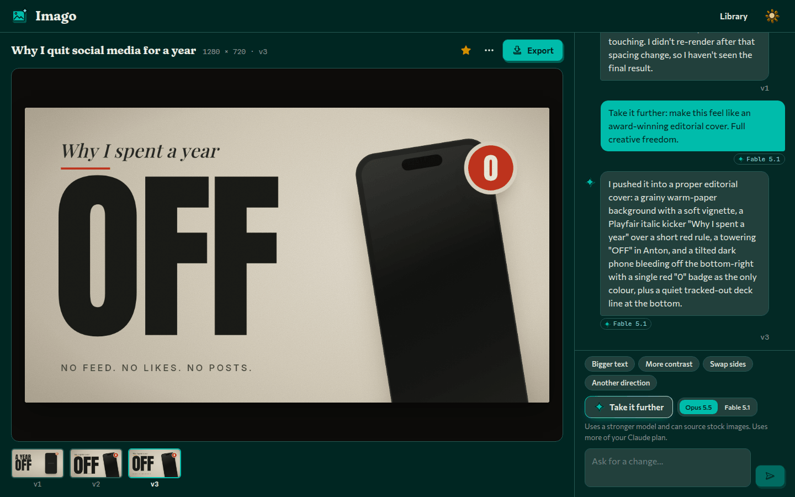
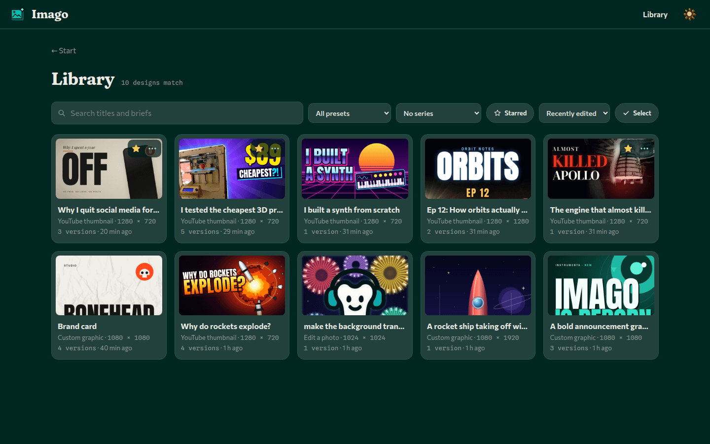

<p align="center"></p>

# Imago

Design thumbnails, photo edits and graphics with your own Claude Code.

Imago is a local web app. You describe the image, and Claude writes it as HTML, CSS and SVG, looks at
its own render and fixes what is wrong. You ask for changes in plain words and export a PNG, JPG or
WebP. Each turn runs `claude -p` on your machine, so it uses your Claude Code sign-in and plan.

Current version: **0.2.0**. It replaced the earlier Konva layer editor and does not read that editor's
documents.



## Presets

| Preset | Starts from | Sizes |
| --- | --- | --- |
| YouTube thumbnail | The video's title or topic, optional channel colours, notes and face photos (cut out locally) | Video 16:9, Shorts 9:16 or Podcast 1:1, designed at 1280 px on the long side. Export defaults to JPG at 3× (3840×2160 for a video) |
| Edit a photo | One uploaded photo and an instruction | The photo's own shape or one of nine crops from 1:1 to 21:9. A crop fits inside the photo, so it is never upscaled |
| Custom graphic | A description and optional reference images | 32 named sizes grouped by platform, print (150 dpi) and screens, or any size from 64 to 4096 px per side |

Exports are 1×, 1.5×, 2× or 3×, up to 8192 px on the long side. After a thumbnail export Imago shows
the file size and warns when it is over 2 MB, the YouTube mobile app's upload limit. The full size
list is in the [contract](docs/redesign-contract.md#presets).

Each turn shows Claude Code's cost figure (`total_cost_usd`). It is an estimate at API prices; on a
subscription nothing is charged for it.

## Take it further

Ordinary turns run on Sonnet 5.5 at medium effort. **Take it further** continues the same conversation
on Opus 5.5 (the default) or Fable 5.1 at high effort, with up to eight render-and-check rounds instead
of four, web search, and openly licensed stock images from Openverse. Image credits are kept and shown
under the preview and returned with exports. Anything typed in the message box goes along as
direction. These turns use more of your plan, Fable the most.



## Library and series

The start screen shows the eight latest designs. **Library** holds all of them, with search, filters
by preset, series and starred, four sort orders, and pages of forty. A design can be renamed, starred,
duplicated, moved to a series or deleted. Deleting can be undone for a few seconds, and deleted
designs stay in a trash folder for seven days. Select mode adds shift-click ranges and a bulk bar for
delete, star, move and downloading the current renders as a zip.

A **series** keeps a channel's thumbnails alike. **New in this style** starts a design in the same
series with the source's render and HTML as a style reference, so layout, type, colours and badges
carry over. From the source's brief only channel settings carry over, never its episode notes.



## Requirements

- Node.js 22 (what CI builds and tests on).
- Claude Code, installed and signed in, on the machine where the Imago server runs. When Instrumenta
  runs Imago on Windows, that machine is the default WSL distribution, so install and sign in to
  `claude` there.
- On Linux or WSL, the Chromium libraries headless Electron needs. `npm install` fetches any that are
  missing into `tools/chromium-libs` without root, using `apt-get download`; `npm run setup:libs`
  repeats that step.

The start screen reports anything missing and how to fix it (`GET /api/capabilities`).

## Run it

```bash
npm install
npm run build     # builds the UI into web/dist
npm start         # server on http://127.0.0.1:49321
```

`npm run dev` runs the server and Vite together for UI work. Adding `?mock=1` to the page URL runs the
UI against canned data instead of the server.

The server only listens on `127.0.0.1`. Settings come from the environment:

| Variable | Default | Meaning |
| --- | --- | --- |
| `PORT` | `49321` | Port to listen on |
| `IMAGO_DATA_DIR` | `~/.local/share/imago` | Where projects, series and the trash live |
| `IMAGO_MODEL`, `IMAGO_EFFORT` | `claude-sonnet-5-5`, `medium` | Model and effort for ordinary turns |
| `IMAGO_FURTHER_MODELS`, `IMAGO_FURTHER_EFFORT` | `opus=claude-opus-5-5,fable=claude-fable-5-1`, `high` | Models and effort for Take it further |
| `IMAGO_TURN_TIMEOUT_MS` | `600000` | A longer turn is killed (doubled for Take it further) |
| `IMAGO_CLAUDE_BIN` | `claude` | The Claude Code executable |

The rest (`IMAGO_WEB_ROOT`, `IMAGO_ALLOWED_ORIGINS`, `IMAGO_ELECTRON_BIN`, `IMAGO_CHROMIUM_LIBS`) are
in the [contract](docs/redesign-contract.md#runtime).

## Where data lives

Each design is a folder, `<IMAGO_DATA_DIR>/projects/<id>/`, holding `project.json`, `design.html`,
`assets/`, a snapshot and a render for each version, and `exports/`. Series are in
`<IMAGO_DATA_DIR>/series.json` and deleted designs in `projects/.trash/`. Delete a design in the app or
delete its folder.

## In Instrumenta

Imago is a `web-service` product, like Discere: the launcher runs `npm start` from the source
checkout and opens the loopback address in a window. It is not in the installer and has no releases of
its own. To update it, `git pull` in `Imago/` and prepare it again (`npm ci` and `npm run build`; the
launcher's Prepare does both). Running it through the launcher on Windows, with the service in WSL, is
not yet verified. The manifest is [`instrumenta/product.json`](instrumenta/product.json).

## Development

```bash
npm test
npm run lint
npm run typecheck
npm run build
```

The tests never call the real Claude. `tests/fixtures/fake-claude.mjs` stands in for `claude -p`, so
no usage is spent.

- [docs/redesign-contract.md](docs/redesign-contract.md) is the spec: layout, design rules, the
  Claude turn and its locked-down flags, the HTTP API and SSE events.
- [CLAUDE.md](CLAUDE.md) has the code map, testing notes and gotchas.

## Family

Imago is part of [Instrumenta](https://github.com/George-Nizor/Instrumenta), a suite of local learning
and creative apps, made by [Bonehead Labs](https://boneheadlabs.org). It follows the Instrumenta brand
v2: a teal framed picture with a sparkle, drawn as a freestanding object. The interface type
(Fraunces, Commissioner, Spline Sans Mono) is SIL OFL 1.1, vendored in `web/public/brand/fonts` with
its licences. Licence: MIT ([LICENSE](LICENSE)). The design fonts in `fonts/` and the bundled
libraries, including the background-removal package used for cut-outs, keep their own licences.
