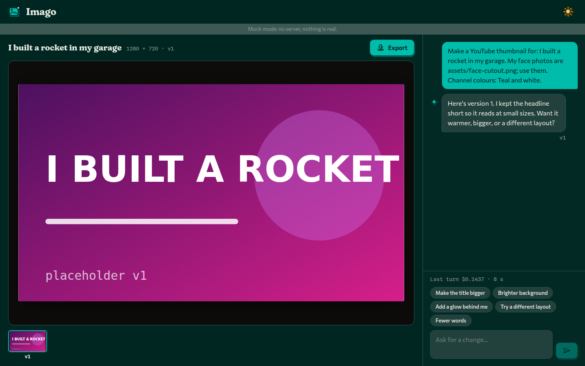
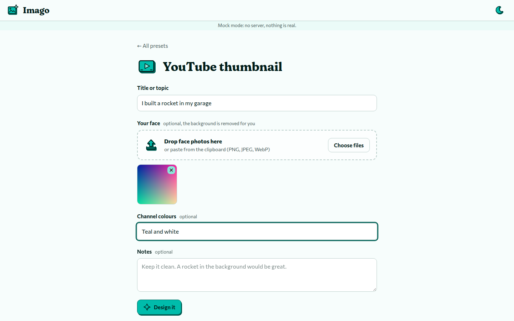
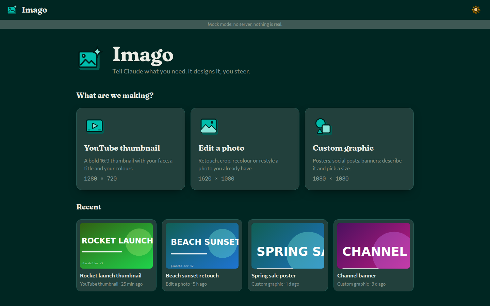

# Imago

Imago designs thumbnails, photo edits and graphics with your own Claude Code. You describe the image
and Claude writes it as HTML, CSS and SVG, looks at its own render, and fixes what is wrong. You ask
for changes in plain words and export a PNG, JPG or WebP.

Current version: **0.2.0**. Imago 0.2.0 replaced the earlier Konva layer editor and its 34-tool MCP
server; the old document model is gone.



## Presets

| Preset | Starts from | Default size |
| --- | --- | --- |
| YouTube thumbnail | The video's title or topic, optional channel colours and notes. Faces can be cut out locally. | 1280×720 |
| Edit a photo | One uploaded photo and an instruction. | The photo's own size, or 1:1, 4:5, 9:16, 16:9 (long edge at most 2160) |
| Custom graphic | A description. | 1080×1080, 1080×1350, 1080×1920, 1200×630, 1600×500, or any size from 64 to 4096 per side |



Each turn shows Claude Code's cost estimate (`total_cost_usd`). That is an API-price figure. On a
subscription nothing is charged for it; it is there so you can see what a turn weighs. Turns seen so
far cost roughly $0.08 to $0.21 at API rates.

## Requirements

- Node.js 22 (what it is built and tested on).
- **Claude Code**, installed and signed in, on the machine where the Imago server runs. When
  Instrumenta runs Imago on Windows that machine is the default WSL distribution, so install and sign
  in to `claude` there.
- Linux or WSL also needs a few Chromium libraries for the headless renderer. `npm install` fetches
  them without root into `tools/chromium-libs` (`npm run setup:libs` repeats that step).

`GET /api/capabilities` reports what is missing, and the start screen shows it with the fix.



## Running it

```bash
npm install
npm run build     # the UI, into web/dist
npm start         # server on http://127.0.0.1:49321
```

`npm run dev` runs the server and Vite together for working on the UI. Opening the page with
`?mock=1` runs the UI against canned data, with no server. The screenshots here were taken that way.

| Variable | Default | Meaning |
| --- | --- | --- |
| `PORT`, `HOST` | `49321`, `127.0.0.1` | Imago only listens on loopback. |
| `IMAGO_DATA_DIR` | `~/.local/share/imago` | Where projects live. |
| `IMAGO_MODEL` | `claude-sonnet-5-5` | Model passed to `claude`. |
| `IMAGO_EFFORT` | `medium` | Effort passed to `claude`. |
| `IMAGO_TURN_TIMEOUT_MS` | `600000` | A turn that runs longer is killed. |
| `IMAGO_CLAUDE_BIN` | `claude` | The Claude Code executable. |

Each project is a folder under `<IMAGO_DATA_DIR>/projects/<id>/` holding `project.json`,
`design.html`, `assets/`, one snapshot and render per version, and `exports/`. Delete a project in
the app or delete its folder.

## The design rules

Claude is told the same rules the server enforces on `design.html`:

- One complete HTML document, with a `body` exactly the image size, `margin: 0` and `overflow: hidden`.
- HTML, CSS and inline SVG only. No scripts, event attributes, frames or external links.
- No network. Every `src`, `href` and `url()` is a project file such as `assets/face.png`, or a
  `data:` URL.
- Fonts come from the bundled set in `fonts/` (Anton, Bebas Neue, Inter, Playfair Display and others).
- At most four renders per turn: write, render, look, fix, stop.

Errors fail the render with a message Claude can act on. Warnings render and are passed back.

## In Instrumenta

Imago is a `web-service` product, like Discere. The launcher starts `npm start` from the checkout and
opens the loopback address in a window. It is not baked into the installer and has no releases of its
own. To update it, `git pull` in `Imago/`, then prepare it (`npm ci` and `npm run build`; the launcher's
Prepare does both). Running it through the launcher on Windows, with the service in WSL, is not yet
verified. The manifest is [`instrumenta/product.json`](instrumenta/product.json).

## Architecture

```text
server/       Node ESM, node:http only: HTTP and SSE, project store, claude runner,
              design.html validation, render MCP, cut-out
render/       render.cjs, headless Electron: design.html to png, jpg or webp
fonts/        content fonts for designs
web/          Vite, React and TypeScript UI, built to web/dist
tests/        node --test
```

A turn runs `claude -p` in the project folder with stream-json output, resumes the stored session,
and hands Claude one internal MCP server with two tools: `render` and `cut_out`. The server learns
about renders from the stream and pushes progress to the page over SSE. The full contract, including
the HTTP API, is in [docs/redesign-contract.md](docs/redesign-contract.md).

## Development and tests

```bash
npm test          # node --test tests/
npm run lint
npm run typecheck
npm run build
```

The tests never call the real Claude. `tests/fixtures/fake-claude.mjs` stands in for `claude -p`:
it writes a design, renders it through the real render MCP and prints stream-json, so no usage is
spent. Developer notes are in [CLAUDE.md](CLAUDE.md).

## Licence and family

Imago is MIT licensed. Bundled fonts and libraries keep their own licences; the interface type
(Fraunces, Commissioner, Spline Sans Mono) is SIL OFL 1.1, copied with its licence files.

Imago is part of [Instrumenta](https://github.com/George-Nizor/Instrumenta), made by Bonehead Labs,
and follows the Instrumenta brand v2: a teal framed picture with a sparkle, drawn as a freestanding
object.
